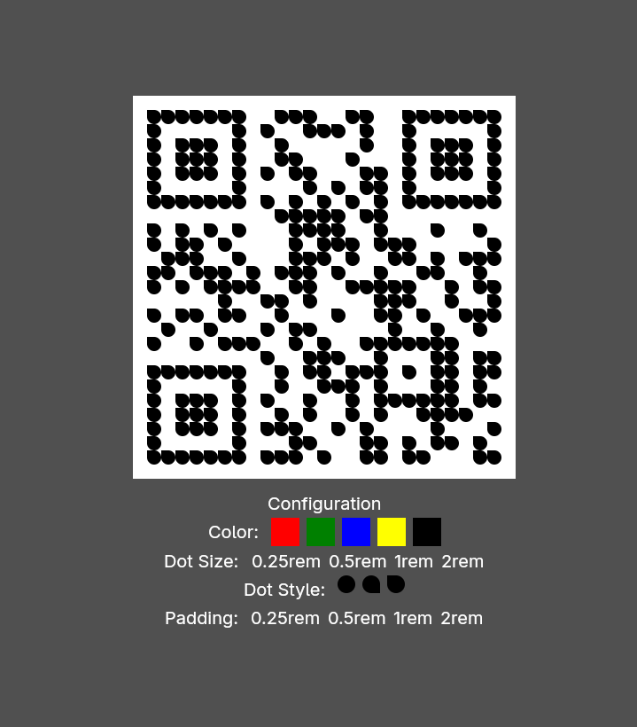

# Simple QR Code Rendering component for [gpui](https://gpui.rs)


## Description

This is a simple QR code rendering component for [gpui](https://gpui.rs). It allows you to easily render QR codes in your gpui applications. It has a gpui-styled-based API to customize the appearance of the QR code to your liking.

## Example
[](./assets/simple-qrcode-example.mp4)
(click to see video)

## Quick Start
Add  via `cargo add gpui-qrcode` or manually to your `Cargo.toml`

```toml
[dependencies]
gpui-qrcode = "0.1.0"
```

For an example usage see the [simple example](./examples/simple.rs).

## Cargo Features

- `qrcode-support` (enabled by default) brings support to directly convert the widget from a QRCode generated by the great [`qrcode`](https://crates.io/crate/qrcode)-crate.
